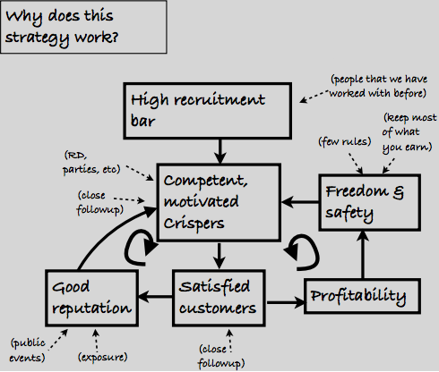

# Why this model works (for us)

This model really works for us! We keep tweaking it, but the overall model has served us well for years now. Our staff turnover is almost zero, the happiness index is rarely below 4, revenue per consultant is about twice as high as a typical consulting company, and our clients gives us amazingly good reviews that we are too humble to write here :o)

But why? Why is this working for us? Here is our guess, illustrated using a [cause-effect diagram](http://blog.crisp.se/2009/09/29/henrikkniberg/1254176460000):

The key thing is the two loops - positive feedback cycles that keep getting stronger and stronger.

## Positive feedback loops

*Left loop:*
 
1. Competent & motivated consultants do a better job, which leads to happy customers.
2. Happy customers give us a good reputation.
3. Good reputation increases our motivation further & attracts new competent people to our company. 
4. GOTO 1

*Right loop:*

1. Competent & motivated consultants do a better job, which leads to happy customer
2. More and happier customers leads to higher profit
3. Higher profit means people can afford to spend time learning new things (instead of trying to make every hour customer-debitable), and feel more safe doing so.
4. Taking time to explore and learn new things together makes us more motivated and more competent!
5. GOTO 1

(hey, when was the last time you got to write a GOTO statement :o)

## Measure and manage motivation. Profit is just a side effect.

The key point is that we focus on keeping ourselves and our customers happy, not profit or growth. Good reputation and profit are simply side effects of keeping ourselves and our customers happy. 

## Hire awesome people, or don't hire at all

Recruitment is crucial - the model only works as long as we are super-picky about who we bring in. If we start getting below-par consultants, the positive loops above could easily turn into negative loops (bad consultants => disappointed customers => bad reputation => the best consultants leave => etc). 

We'd rather grow too slow than too fast, so we pretty much only hire people that we already know are awesome. We're a bit lazy in that sense, and grateful for other companies that provide a place for the juniors to grow and learn :o)

See [Recruiting](recruiting.html) for more details on this.

 

